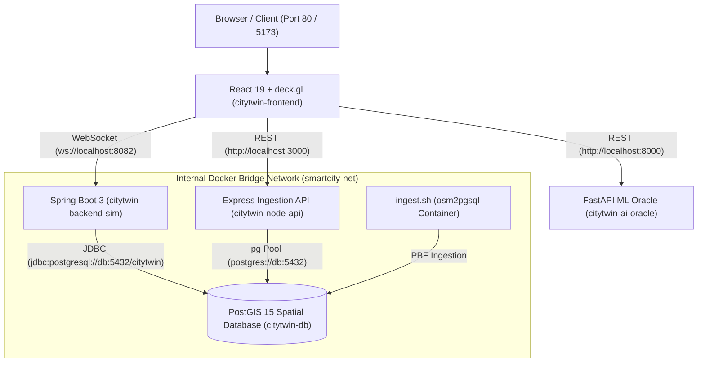

# 🌆 Smart City Digital Twin

[](https://docs.docker.com/compose/)
[](https://react.dev/)
[](https://deck.gl/)
[](https://spring.io/projects/spring-boot)
[](https://fastapi.tiangolo.com/)
[](https://postgis.net/)

An interactive, real-time 3D spatial digital twin and predictive analytics platform. Visualizes urban mobility, models dynamic congestion cascades across street networks, features intelligent A* emergency response routing, and leverages a Machine Learning "What-If" Oracle to predict cascading pollution spikes and emergency delays during road closures.

---

## 🏛️ System Architecture

The system is built as a **4-tier microservices architecture** connected via a dedicated Docker bridge network (`smartcity-net`):



---

## 🚀 Core Features

### 1. 3D WebGL Spatial Visualization ([React 19](https://react.dev/) + [deck.gl](https://deck.gl/))
- **`GeoJsonLayer`**: Renders high-fidelity street networks with dynamic closed-road hazard highlighting.
- **`ScatterplotLayer`**: Tracks moving vehicle fleets and emergency ambulances with distinct color/radius styling.
- **`HeatmapLayer`**: Dynamic 6-stop gradient (blue to crimson) mapping live urban pollution hotspots based on vehicle density.
- **`PathLayer`**: Renders real-time A* ambulance routing corridors and 2030 transit hyperloops.
- **Interactive Tooltips**: Hover over roads, vehicles, substations, and EV charging stations for live metadata.

### 2. Multi-Scenario Modeling Engine
Switch dynamically between 5 distinct urban simulation modes:
1. **Current Infrastructure**: Live baseline digital twin with real-time traffic fleet and pollution heatmap.
2. **2030 Master Plan**: Autonomous hyperloop transit corridors, Broadway zero-emission greenways, drone logistics skyways, and 5G sensor poles.
3. **Peak Traffic Simulation**: Choke-point modeling with heavy congestion and elevated emission weights.
4. **Energy Grid & Smart Utilities**: Telemetry on 138kV transmission backbones, solar storage hubs, and EV fast chargers.
5. **Emergency Response Priority**: Centers on the emergency ambulance with dynamic A* pathfinding.

### 3. Core Simulation Engine (Java 17 + Spring Boot)
- **PostGIS Ingestion**: Queries `planet_osm_line` via JDBC, transforming EPSG:3857 geometries to standard EPSG:4326 coordinates (`ST_Transform(way, 4326)`).
- **Dynamic A* Routing**: Calculates optimal shortest paths for emergency units, penalizing congested road segments.
- **WebSocket Broadcast**: High-frequency streaming of entity positions and pollution density every 100ms on port `8082`.

### 4. Machine Learning "What-If" Oracle (Python 3.10 + FastAPI)
- **Trained Model**: `RandomForestRegressor` predicting cascading delay (seconds) and pollution spikes (%) caused by bottlenecking specific intersections.
- **REST Endpoint**: `GET /predict?closed_road_id={id}` on port `8000`.

### 5. Resilient Standalone Simulation Fallback
- Includes a client-side physics simulation engine in the frontend that runs smoothly when backend containers are offline, and automatically yields to the Spring Boot WebSocket when live.

---

## 📋 Microservices & Ports Reference

| Container Name | Service | Technology | Port | Description |
| :--- | :--- | :--- | :--- | :--- |
| `citytwin-frontend` | Frontend UI | React 19, deck.gl, Nginx | `80` | Interactive 3D Digital Twin dashboard |
| `citytwin-backend-sim` | Simulation Engine | Java 17, Spring Boot 3.2.5 | `8082` | WebSocket traffic & A* routing engine |
| `citytwin-ai-oracle` | AI Oracle API | Python 3.10, FastAPI, scikit-learn | `8000` | Machine Learning What-If Regressor |
| `citytwin-node-api` | Ingestion API | Node.js 18, Express | `3000` | Spatial GeoJSON query endpoint (`/api/roads`) |
| `citytwin-db` | Spatial Database | PostGIS 15, PostgreSQL | `5432` | OpenStreetMap spatial tables (`planet_osm_line`) |

---

## ⚡ Quick Start (Docker Orchestration)

### Prerequisites
- [Docker](https://docs.docker.com/get-docker/) & [Docker Compose](https://docs.docker.com/compose/install/)

### 1. Launch the Cluster
```bash
docker compose up -d --build
```
This builds and boots all 5 containers on the shared `smartcity-net` bridge network with healthchecks.

### 2. Ingest OpenStreetMap Data into PostGIS
Populate the database with city spatial data using the automated ingestion script:

#### Option A: Ingest New York City (Default Metro Extract)
```bash
./ingest.sh newyork
```
*Or manually via Docker:*
```bash
curl -O https://download.bbbike.org/osm/bbbike/NewYork/NewYork.osm.pbf

docker run --rm --network=smartcity-net -v "${PWD}:/osm" iboates/osm2pgsql:latest \
  -c -d postgresql://admin:admin@db:5432/citytwin /osm/NewYork.osm.pbf
```

#### Option B: Ingest Monaco (Compact Test Extract)
```bash
./ingest.sh monaco
```

### 3. Restart the Simulation Backend
Restart the Spring Boot container so it constructs its in-memory graph from the populated PostGIS tables:
```bash
docker compose restart backend-sim
```

### 4. Open the Dashboard
Navigate to **`http://localhost`** in your browser.

---

## 💻 Local Development (Outside Docker)

### Frontend (React + Vite)
```bash
cd frontend
npm install
npm run dev
# Dashboard available at http://localhost:5173
```

### Backend (Spring Boot)
```bash
cd backend
./mvnw spring-boot:run
# WebSocket available at ws://localhost:8082/ws/simulation
```

### AI Oracle (Python FastAPI)
```bash
cd ai-oracle
pip install -r requirements.txt
python generate_data.py
python train_model.py
uvicorn main:app --host 0.0.0.0 --port 8000
# REST API available at http://localhost:8000/predict
```

---

## 🎮 Dashboard Controls & Usage

1. **Urban Scenario Mode**: Choose between *Current Infrastructure*, *2030 Master Plan*, *Peak Traffic*, *Energy Grid*, and *Emergency Response Priority*.
2. **Camera Perspective**: Quick camera switches (*Isometric 3D*, *Midtown Core*, *Ambulance Focus*, *2D Map*).
3. **Layer Visibility**: Toggle individual layers (*Road Network*, *Live Fleet*, *Pollution Heatmap*, *Emergency Route*, *2030 Transit Loop*, *IoT Energy Grid*).
4. **AI Oracle What-If Analysis**: Select any road in the dropdown to simulate a closure. The road highlights in hazard red on the 3D map, and the Oracle computes the predicted delay and pollution impact.

---

## 📁 Repository Structure

```
Smart-City-Simultation/
├── docker-compose.yml              # Master Docker Compose orchestration
├── Dockerfile                      # Node.js Ingestion API Dockerfile
├── index.js                        # Node.js Express spatial API (/api/roads)
├── simulation.js                   # Node.js simulation helper
├── graphUtils.js                   # Graph utilities
├── ingest.sh                       # OpenStreetMap PostGIS ingestion script
│
├── frontend/                       # React + deck.gl 3D Dashboard
│   ├── Dockerfile                  # Multi-stage Nginx build
│   ├── nginx.conf                  # Custom Nginx SPA configuration
│   ├── package.json
│   ├── vite.config.js
│   └── src/
│       ├── App.jsx                 # State & scenario coordinator
│       ├── index.css               # Glassmorphic dark-mode design system
│       ├── components/
│       │   ├── DeckGLMap.jsx       # deck.gl WebGL layer renderer
│       │   └── Sidebar.jsx         # Controls, KPI HUD & What-If panel
│       ├── data/
│       │   ├── smartCityData.js    # Spatial datasets (Manhattan grid, 2030 plan, energy grid)
│       │   └── mockRoads.json      # Sample road GeoJSON
│       └── utils/
│           └── localSimulation.js  # Standalone client simulation engine
│
├── backend/                        # Java Spring Boot Simulation Engine
│   ├── Dockerfile                  # Multi-stage Temurin-17 Maven build
│   ├── pom.xml                     # Spring Boot 3.2.5 LTS dependencies
│   └── src/main/
│       ├── java/com/smartcity/simulation/backend/
│       │   ├── SimulationApplication.java
│       │   ├── SimulationEngine.java   # Entity loop & pollution index
│       │   ├── GraphService.java       # PostGIS EPSG:4326 graph ingestion
│       │   ├── SimulationHandler.java  # WebSocket handler
│       │   └── WebSocketConfig.java    # WebSocket endpoint configuration
│       └── resources/
│           └── application.properties
│
└── ai-oracle/                      # Python FastAPI Machine Learning Oracle
    ├── Dockerfile                  # Python 3.10-slim container
    ├── requirements.txt
    ├── main.py                     # FastAPI REST API (/predict)
    ├── generate_data.py            # Synthetic scenario generator
    ├── train_model.py              # RandomForestRegressor trainer
    └── mockRoads.json
```

---

## 📜 License
MIT License. Built for Smart City Digital Twin Simulation and Urban Predictive Analytics.
